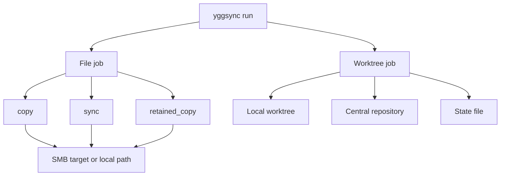
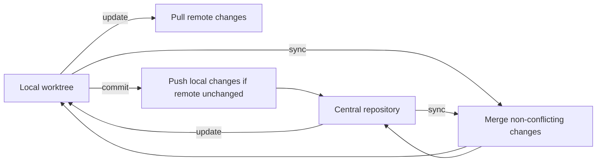

# yggsync

`yggsync` is a small native sync engine for Yggdrasil endpoints.
It copies files to SMB shares or plain local paths without shelling out to `rclone`.

This README is the operator manual for editing and running `~/.config/ygg_sync.toml`.

## Overview

`yggsync` has two modes:

- file jobs for screenshots, media, archives, and backups
- worktree jobs for a local working copy against a central repository, especially Obsidian

That split is deliberate. Generic two-way sync is the wrong model for a live vault on SMB.



## Concepts

### Job Types

- `copy`: copy local files to the destination
- `sync`: mirror local files to the destination and delete remote files missing locally
- `retained_copy`: copy first, then prune eligible local files only after remote confirmation
- `worktree`: local working copy against a central repository with explicit state tracking

`bisync` is accepted as a legacy alias for `worktree`.

### Target Types

The remote side can be either:

- a named target from `[[targets]]`
- a plain absolute local path

Today `yggsync` supports:

- `type = "smb"`
- `type = "local"`

Remote values work like this:

- `remote = "nas:immich/alice/DCIM"` means target `nas`, relative path `immich/alice/DCIM`
- `remote = "/mnt/nas/data/archive"` means use that mounted local path directly

### Worktree Model

`worktree` is closer to an `SVN` working-copy model than to a generic filesystem bisync.

- `update`: pull remote changes into local
- `commit`: push local changes only if the remote has not changed since the saved state
- `sync`: merge non-conflicting local and remote changes using the saved state

If both sides changed the same path, `yggsync` fails with a conflict error.
It does not create `.conflictN` files on your behalf.



## What You Edit

For most setups, you usually change only these fields.

### Top-Level Keys

Normally leave these alone:

- `lock_file`
- `worktree_state_dir`

### In `[[targets]]`

Usually edit:

- `host`
- `share`
- `username` or `username_env`
- `password_env` or `password`
- `base_path` if all jobs live under one common subtree
- `path` for `type = "local"`

Prefer `password_env` over `password` for steady-state use.

### In `[[jobs]]`

Usually edit:

- `local`
- `remote`
- `local_retention_days` for `retained_copy`
- `filter_rules`, `include`, or `exclude`
- `timeout_seconds` for very large jobs

Rules:

- do not mix `filter_rules` with `include` or `exclude` in the same job
- `retained_copy` without `local_retention_days` is usually a mistake
- use `worktree` for local-vault-to-central-repository sync
- use `sync` only when remote deletions are intended

## First Run

The safest first run is small and explicit.

1. Put credentials in the environment if the target uses `password_env`.
2. List jobs.
3. Dry-run one small file job.
4. If you use `worktree`, choose `update` or `commit` explicitly for the first initialization.
5. Only after that, let scheduled jobs run normally.

Example:

```bash
export SAMBA_PASSWORD='your-password'
yggsync -config ~/.config/ygg_sync.toml -list
yggsync -config ~/.config/ygg_sync.toml -jobs screenshots -dry-run
yggsync -config ~/.config/ygg_sync.toml -jobs obsidian -worktree-op update
```

## Normal Operation

### File Jobs

For ordinary file jobs, the normal pattern is:

1. render or edit the config once
2. dry-run
3. let `yggclient` or your own scheduler call `yggsync`

### Worktree Jobs

Use these commands deliberately:

- `update` when the remote is the source of truth and you want to refresh local
- `commit` when local changes should become canonical on the remote
- `sync` when the worktree already exists and you want non-conflicting merge behavior

On first initialization:

- if one side is empty, `yggsync` can initialize from the populated side
- if both sides are populated but differ, `yggsync` stops and requires explicit `update` or `commit`

## Config Patterns

### SMB Target

```toml
[[targets]]
name = "nas"
type = "smb"
host = "nas.internal"
share = "data"
username = "smb-login"
password_env = "SAMBA_PASSWORD"
```

Optional fields:

- `port`
- `base_path`
- `domain`
- `username_env`
- `password`

### Local Target

```toml
[[targets]]
name = "mounted"
type = "local"
path = "/mnt/nas/data"
```

This is useful when a laptop already uses a mounted NAS path and you do not want `yggsync` opening its own SMB session.

### Android Media Example

```toml
[[jobs]]
name = "screenshots"
type = "retained_copy"
local = "~/storage/shared/Pictures/Screenshots"
remote = "nas:immich/path-user/android/Screenshots"
local_retention_days = 31
```

### Laptop Mounted-Share Example

```toml
[[jobs]]
name = "screenshots"
type = "copy"
local = "~/Pictures/Screenshots"
remote = "/mnt/nas/data/immich/path-user/desktop/Screenshots"
```

Use this only if the destination is a real mount point.
Guard scheduled runs so a missing mount does not turn into writes into an empty local directory.

### Obsidian Worktree Example

```toml
[[jobs]]
name = "obsidian"
type = "worktree"
local = "~/Documents/obsidian"
remote = "nas:smbfs/path-user/obsidian"
filter_rules = [
  "- **/.obsidian/**",
  "- **/.trash/**",
  "- **/*.conflict*",
]
```

For SMB shares that expose DOS 8.3 aliases, exclude them too:

```toml
filter_rules = [
  "- **/.obsidian/**",
  "- **/.trash/**",
  "- **/*.conflict*",
  "- [A-Za-z0-9_][A-Za-z0-9_][A-Za-z0-9_][A-Za-z0-9_][A-Za-z0-9_][A-Za-z0-9_]~[A-Za-z0-9].*",
  "- **/[A-Za-z0-9_][A-Za-z0-9_][A-Za-z0-9_][A-Za-z0-9_][A-Za-z0-9_][A-Za-z0-9_]~[A-Za-z0-9].*",
]
```

## Filters

`yggsync` supports:

- `include`
- `exclude`
- `filter_rules`

`filter_rules` are order-sensitive and support:

- `+ pattern`
- `- pattern`

Patterns are glob-style and support:

- `*`
- `**`
- `?`
- character classes like `[A-Za-z0-9_]`

Use `filter_rules` when simple include/exclude is not expressive enough.

## Troubleshooting

### `unknown job`

The job name in `-jobs` does not match any configured `[[jobs]].name`.
Run:

```bash
yggsync -config ~/.config/ygg_sync.toml -list
```

### `initial worktree is ambiguous`

Both local and remote already contain data and there is no saved state yet.
Choose one explicitly:

- `-worktree-op update`
- `-worktree-op commit`

### `remote changed since last state`

You tried `commit` after the remote changed independently.
Run `sync` or `update` first, then commit again if needed.

### Obsidian conflict churn or weird alias names

Usually this means one of these:

- multiple live writers touched the same vault
- `.obsidian` or other high-churn paths were not filtered
- the SMB server exposed DOS alias names and they were not filtered

### Mounted NAS path wrote to the wrong place

This usually means the mount was absent and the path resolved locally.
Guard scheduled runs with a mount check such as:

```ini
[Unit]
ConditionPathIsMountPoint=/mnt/nas/data
```

## CLI Reference

Common commands:

```bash
yggsync -config ~/.config/ygg_sync.toml
yggsync -jobs dcim,screenshots
yggsync -jobs notes -worktree-op update
yggsync -jobs notes -worktree-op commit
yggsync -jobs notes -worktree-op sync
yggsync -jobs notes -dry-run
yggsync -list
yggsync -version
```

Flags:

- `-config`: config file path. Defaults to `~/.config/ygg_sync.toml` or `$YGG_SYNC_CONFIG`
- `-jobs`: comma-separated job names. Default is all jobs
- `-dry-run`: simulate file operations
- `-worktree-op`: `sync`, `update`, or `commit`
- `-list`: print configured job names
- `-version`: print the binary version

Legacy compatibility:

- `--resync` and `--force-bisync` are accepted as no-op compatibility flags while old wrappers are migrated

## Build

```bash
go build ./cmd/yggsync
```

Cross-build examples:

```bash
GOOS=linux GOARCH=amd64 CGO_ENABLED=0 go build -o dist/yggsync-linux-amd64 ./cmd/yggsync
GOOS=android GOARCH=arm64 CGO_ENABLED=0 go build -o dist/yggsync-android-arm64 ./cmd/yggsync
```
